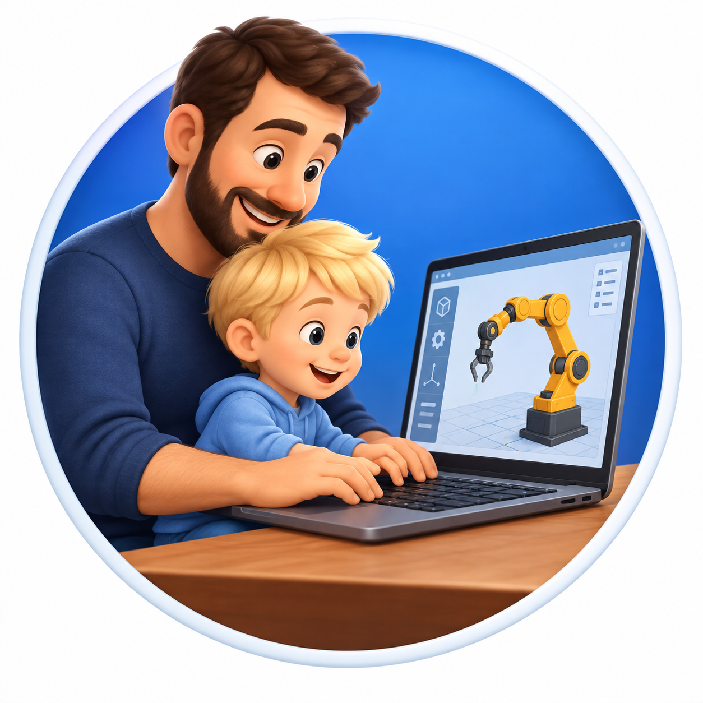
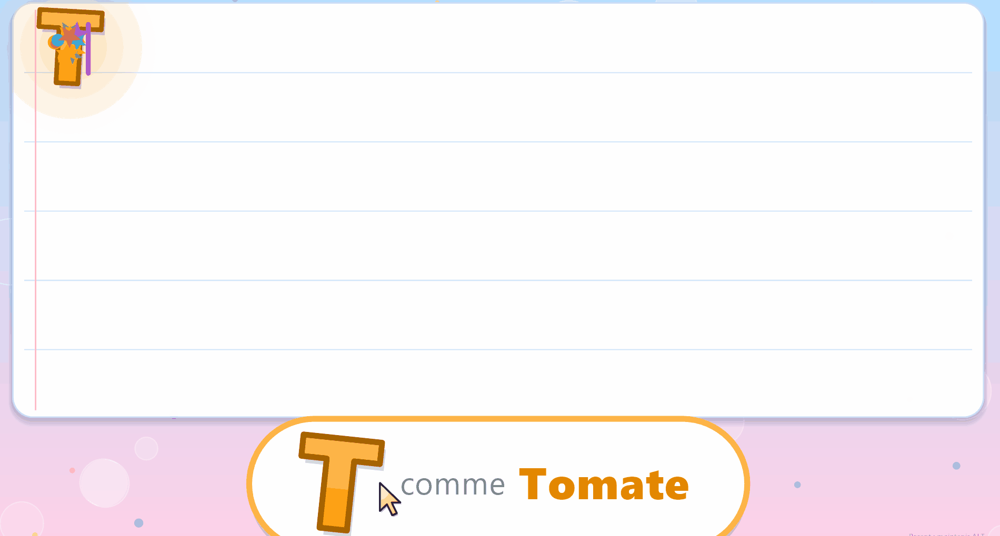
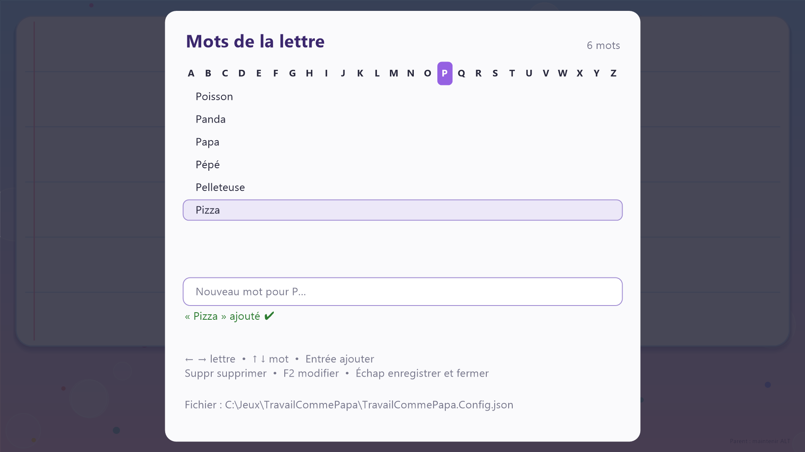

<p align="center">
  
</p>

<h1 align="center">Travail comme Papa</h1>

<p align="center">
  
</p>

<p align="center">
  <a href="https://github.com/Rufus31415/travail-comme-papa/releases/latest/download/TravailCommePapa.exe"><b>⬇️&nbsp;&nbsp;Télécharger TravailCommePapa.exe</b></a>
  <br>
  <sub>Dernière version · Windows 10/11 · un seul fichier, rien à installer</sub>
</p>

---

Application Windows plein écran pour les enfants de 2-3 ans. Elle leur fait découvrir le clavier et la souris d'un vrai PC, sans qu'ils puissent en sortir.

## Ce que fait l'enfant

| Action | Résultat |
|---|---|
| Clic gauche / droit / molette | Dessine en **rouge** / **vert** / **bleu** (boutons latéraux : orange / violet) |
| Lettre | Écrite en **MAJUSCULE** (même si Verr. Maj est actif). La voix dit « A comme Abricot » pendant que la lettre grossit, danse et brille. Une bulle en bas affiche le mot |
| Chiffre (rangée du haut ou pavé numérique) | Le chiffre est prononcé, et la bulle montre autant de ronds que sa valeur |
| Entrée / Espace | Retour à la ligne / espace |
| Retour arrière / Suppr | Efface avant / après le curseur |
| Flèches, Début, Fin | Déplacent le curseur de texte (la souris sert uniquement à dessiner) |

Les mots changent à chaque fois (roulement). Tous les mots d'une lettre passent avant qu'un mot ne revienne. Ils se personnalisent depuis la console parent, voir [Personnaliser les mots](#personnaliser-les-mots).

Une touche maintenue enfoncée n'écrit sa lettre qu'une seule fois.

## Console parent

**Maintenir ALT environ 1,5 s.** Un cercle de progression apparaît en bas à droite, puis la console s'ouvre. Toujours en tenant ALT, appuyer sur :

- **F4** : quitter
- **C** : tout effacer (dessin + texte)
- **D** : effacer le dessin
- **T** : effacer le texte
- **S** : enregistrer une image PNG dans `Images\Travail comme Papa\`
- **M** : couper / rétablir le son du PC
- **V** : remettre le volume du PC à 30 %
- **W** : modifier les mots de chaque lettre (voir ci-dessous)

Relâcher ALT ferme la console. Le délai se règle avec `AdminHoldMs`, et le niveau de la touche **V** avec `AdminVolumeLevel`, dans [MainForm.cs](TravailCommePapa/MainForm.cs). Les touches multimédia étant bloquées, **M** et **V** sont le seul moyen d'agir sur le volume sans quitter l'application.

## Personnaliser les mots

Pour que « P comme Papa » devienne « P comme Pizza » (ou pour ajouter les prénoms de la famille), ouvrir la console parent (ALT maintenu 1,5 s) puis appuyer sur **W**. L'éditeur reste ouvert quand on relâche ALT.

<p align="center">
  
</p>

| Touche | Action |
|---|---|
| **←** / **→** | Lettre précédente / suivante (**Début** = A, **Fin** = Z) |
| **↑** / **↓** | Choisir un mot de la lettre |
| *(taper du texte)* | Saisir un nouveau mot, **Entrée** pour l'ajouter. Il doit commencer par la lettre (accents ignorés), éventuellement après un article : *le, la, les, un, une* (« Les Yeux » pour Y) |
| **Suppr** | Supprimer le mot sélectionné |
| **F2** | Corriger le mot sélectionné (il repasse dans la zone de saisie) |
| **Échap** | Enregistrer et fermer |

Les mots sont enregistrés dans **`TravailCommePapa.Config.json`**, posé à côté de l'exe (son chemin est rappelé en bas de l'éditeur). Si ce dossier n'est pas modifiable (Program Files par exemple), le fichier est écrit dans `%APPDATA%\TravailCommePapa\`. Au démarrage, le plus récent des deux est utilisé.

- Sans fichier de config, l'application utilise les mots par défaut de [Words.cs](TravailCommePapa/Words.cs) (sans prénoms).
- Une lettre sans aucun mot dans le fichier retrouve ses mots par défaut.
- Le fichier est simple à éditer à la main : `{ "Words": { "A": ["Avion", "Abeille"], "B": ["Ballon"] } }`. Effacer le fichier revient aux mots par défaut.
- Les nouveaux mots sont préparés par la voix juste après l'enregistrement : ils peuvent avoir quelques secondes de latence la toute première fois.

## Verrouillage : ce qui est bloqué

- **Toutes** les touches sont interceptées par un hook clavier bas niveau avant Windows : touche Windows, Alt+Tab, Alt+Échap, Ctrl+Échap, Alt+F4, Ctrl+Maj+Échap, touche Menu, touches multimédia (volume/muet)…
- Fenêtre sans bordure, plein écran, au-dessus de tout, qui reprend le premier plan toutes les 300 ms.
- La souris est confinée à l'écran principal. Les écrans secondaires sont recouverts.
- Les popups « Touches rémanentes » (Maj ×5), « Touches filtres » et « Touches bascules » sont désactivées pendant l'utilisation, puis restaurées à la fermeture.
- Le **bouton d'alimentation** est mis sur « Ne rien faire » dans le plan de gestion de l'alimentation : un appui court n'éteint plus le PC. Le réglage d'origine est rendu à la fermeture.
- L'écran ne se met pas en veille.

### Limites (impossible à bloquer par une application)

- **Ctrl+Alt+Suppr** et **Win+L** : gérés directement par Windows. Win+L verrouille simplement la session, sans danger.
- **Gestes du pavé tactile** (3-4 doigts) et **balayages depuis le bord** d'un écran tactile : les désactiver dans *Paramètres > Bluetooth et appareils > Pavé tactile* si besoin.
- **Appui long sur le bouton d'alimentation** (4 s et plus) : c'est une coupure matérielle, hors de portée de Windows. Seul l'appui court est neutralisé.

Le mode kiosque Windows (Accès attribué) demande un compte dédié et une reconnexion. Il n'est donc pas utilisé : après ALT+F4, le PC est immédiatement utilisable.

## Compiler / lancer

Prérequis : SDK .NET 9 (ou plus récent), pour compiler seulement. L'exe produit est autonome (runtime .NET inclus, environ 57 Mo) : rien à installer pour le lancer.

```powershell
./build.ps1                        # produit publish\TravailCommePapa.exe
# ou pour développer :
dotnet run --project TravailCommePapa
```

### Publier une version

Pousser un tag `v*` suffit : la [GitHub Action](.github/workflows/release.yml) compile `TravailCommePapa.exe` et le publie dans une release, dont les notes listent les messages des commits depuis la release précédente.

```powershell
git tag v1.0.0
git push origin v1.0.0
```

La voix utilise les voix françaises « OneCore » de Windows (Julie en priorité, puis Hortense, puis Paul). L'ordre se change dans `PreferredVoices` de [Speaker.cs](TravailCommePapa/Speaker.cs). Toutes les phrases sont préparées en mémoire au démarrage, ce qui supprime la latence. Si ces voix sont absentes, l'app se replie sur l'ancienne voix SAPI, et sans aucune voix elle fonctionne quand même, en silence.

Les phrases (« B comme Ballon », lues naturellement d'une traite) sont définies dans [SpeechScript.cs](TravailCommePapa/SpeechScript.cs), où `LetterNames` corrige les lettres que la voix écorche (Y se dit « I grec »). Un court silence est ajouté au début de chaque phrase, sans quoi la carte son avale la première consonne (« Zède » devient « ède »).
